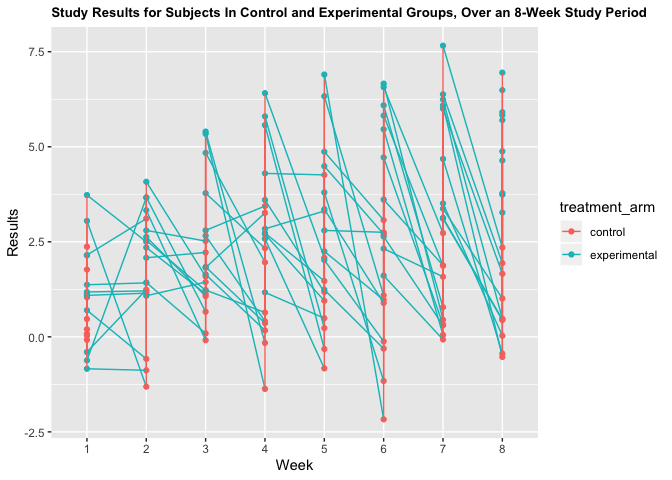

p8105\_hw5\_amh2325
================
Amanda Howarth
11/7/2019

\#Load IRIS dataset from the TIDYVERSE

``` r
library(tidyverse)

set.seed(10)

iris_with_missing = iris %>% 
  map_df(~replace(.x, sample(1:150, 20), NA)) %>%
  mutate(Species = as.character(Species)) %>% 
  janitor::clean_names()
```

## PROBLEM 1

Write a function that takes a vector as an argument; replaces missing
values using the rules defined above; and returns the resulting vector.
Apply this function to the columns of iris\_with\_missing using a map
statement.

``` r
iris_function1 = function(x) {
  if(!is.numeric(x))
    replace_na(x, "virginica")
  else if (is.numeric(x))
    replace_na(mean(x, na.rm = TRUE))
  }
```

CHECK FUNCTION

``` r
iris_function1(iris_with_missing$petal_width)
```

    ## [1] 1.192308

``` r
mean(iris_with_missing$petal_width, na.rm=TRUE)
```

    ## [1] 1.192308

``` r
replace_iris = map(.x=iris_with_missing, ~iris_function1(.x))
replace_iris
```

    ## $sepal_length
    ## [1] 5.819231
    ## 
    ## $sepal_width
    ## [1] 3.075385
    ## 
    ## $petal_length
    ## [1] 3.765385
    ## 
    ## $petal_width
    ## [1] 1.192308
    ## 
    ## $species
    ##   [1] "setosa"     "setosa"     "setosa"     "setosa"     "setosa"    
    ##   [6] "setosa"     "setosa"     "setosa"     "setosa"     "setosa"    
    ##  [11] "setosa"     "setosa"     "setosa"     "setosa"     "setosa"    
    ##  [16] "setosa"     "setosa"     "setosa"     "setosa"     "setosa"    
    ##  [21] "setosa"     "virginica"  "setosa"     "setosa"     "virginica" 
    ##  [26] "setosa"     "virginica"  "setosa"     "setosa"     "setosa"    
    ##  [31] "setosa"     "setosa"     "setosa"     "setosa"     "setosa"    
    ##  [36] "setosa"     "setosa"     "setosa"     "setosa"     "setosa"    
    ##  [41] "setosa"     "virginica"  "setosa"     "setosa"     "setosa"    
    ##  [46] "virginica"  "setosa"     "setosa"     "setosa"     "setosa"    
    ##  [51] "virginica"  "versicolor" "versicolor" "versicolor" "versicolor"
    ##  [56] "versicolor" "virginica"  "versicolor" "virginica"  "versicolor"
    ##  [61] "versicolor" "versicolor" "versicolor" "versicolor" "versicolor"
    ##  [66] "versicolor" "versicolor" "versicolor" "versicolor" "versicolor"
    ##  [71] "versicolor" "virginica"  "versicolor" "versicolor" "versicolor"
    ##  [76] "versicolor" "versicolor" "versicolor" "versicolor" "virginica" 
    ##  [81] "versicolor" "versicolor" "versicolor" "versicolor" "versicolor"
    ##  [86] "versicolor" "versicolor" "versicolor" "versicolor" "versicolor"
    ##  [91] "versicolor" "versicolor" "versicolor" "virginica"  "versicolor"
    ##  [96] "versicolor" "versicolor" "versicolor" "versicolor" "virginica" 
    ## [101] "virginica"  "virginica"  "virginica"  "virginica"  "virginica" 
    ## [106] "virginica"  "virginica"  "virginica"  "virginica"  "virginica" 
    ## [111] "virginica"  "virginica"  "virginica"  "virginica"  "virginica" 
    ## [116] "virginica"  "virginica"  "virginica"  "virginica"  "virginica" 
    ## [121] "virginica"  "virginica"  "virginica"  "virginica"  "virginica" 
    ## [126] "virginica"  "virginica"  "virginica"  "virginica"  "virginica" 
    ## [131] "virginica"  "virginica"  "virginica"  "virginica"  "virginica" 
    ## [136] "virginica"  "virginica"  "virginica"  "virginica"  "virginica" 
    ## [141] "virginica"  "virginica"  "virginica"  "virginica"  "virginica" 
    ## [146] "virginica"  "virginica"  "virginica"  "virginica"  "virginica"

## PROBLEM 2

Create a tidy dataframe containing data from all participants, including
the subject ID, arm, and observations over time.

``` r
treatment_study = list.files(path="./data/", full.names = TRUE)

treatment_study_data = 
  treatment_study %>%
  map_df(read.csv) %>% 
  mutate(
    "subject_id" = c(1:10, 1:10),
    "treatment_arm" = c("control", "control", "control", "control", "control", "control", "control", "control", "control", "control", "experimental", "experimental", "experimental", "experimental", "experimental", "experimental", "experimental", "experimental", "experimental", "experimental")
  ) %>% 
  select("subject_id", "treatment_arm", everything())%>% 
  pivot_longer(
    week_1:week_8, 
    names_to = "week",
    values_to = "result"
  ) %>%
  mutate(week = recode(week, "week_1" = "1", "week_2" = "2", "week_3" = "3", "week_4" = "4", "week_5" = "5", "week_6" = "6", "week_7" = "7", "week_8" = "8"))

treatment_study_data
```

    ## # A tibble: 160 x 4
    ##    subject_id treatment_arm week  result
    ##         <int> <chr>         <chr>  <dbl>
    ##  1          1 control       1       0.2 
    ##  2          1 control       2      -1.31
    ##  3          1 control       3       0.66
    ##  4          1 control       4       1.96
    ##  5          1 control       5       0.23
    ##  6          1 control       6       1.09
    ##  7          1 control       7       0.05
    ##  8          1 control       8       1.94
    ##  9          2 control       1       1.13
    ## 10          2 control       2      -0.88
    ## # … with 150 more rows

Make a spaghetti plot showing observations on each subject over time,
and comment on differences between
groups.

``` r
ggplot(treatment_study_data, aes(x = week, y = result, group = subject_id, color = treatment_arm)) + 
  geom_point() + geom_line() +
  labs(title = "Study Results for Subjects In Control and Experimental Groups, Over an 8-Week Study Period", 
           x = "Week",
           y = "Results") +
  theme(plot.title = element_text(size = 10, face = "bold"))
```

<!-- -->
Overall, the subejcts in the control group experienced results of lower
values each week (for all weight weeks) than subjects in the
experimental group.
