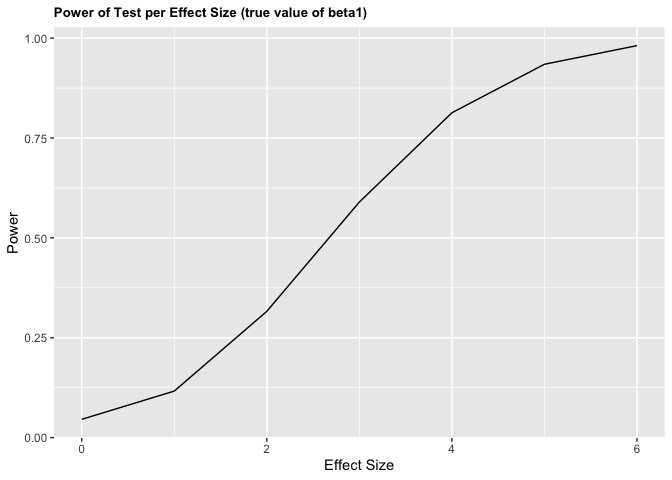

p8105\_hw5\_amh2325
================
Amanda Howarth
11/7/2019

## Load IRIS dataset from the TIDYVERSE

``` r
library(tidyverse)

set.seed(10)

iris_with_missing = iris %>% 
  map_df(~replace(.x, sample(1:150, 20), NA)) %>%
  mutate(Species = as.character(Species)) %>% 
  janitor::clean_names()
```

## PROBLEM 1

Write a function that takes a vector as an argument; replaces missing
values using the rules defined above; and returns the resulting vector.
Apply this function to the columns of iris\_with\_missing using a map
statement.

``` r
iris_function1 = function(x) {
  if (is.numeric(x)) {
    replace_na(x, mean(x, na.rm = TRUE)) }
    
  else if(!is.numeric(x)) {
    replace_na(x, "virginica") }
}
```

``` r
replace_iris = map(.x=iris_with_missing, ~iris_function1(.x)) %>% 
  as_tibble
replace_iris
```

    ## # A tibble: 150 x 5
    ##    sepal_length sepal_width petal_length petal_width species
    ##           <dbl>       <dbl>        <dbl>       <dbl> <chr>  
    ##  1         5.1          3.5         1.4         0.2  setosa 
    ##  2         4.9          3           1.4         0.2  setosa 
    ##  3         4.7          3.2         1.3         0.2  setosa 
    ##  4         4.6          3.1         1.5         1.19 setosa 
    ##  5         5            3.6         1.4         0.2  setosa 
    ##  6         5.4          3.9         1.7         0.4  setosa 
    ##  7         5.82         3.4         1.4         0.3  setosa 
    ##  8         5            3.4         1.5         0.2  setosa 
    ##  9         4.4          2.9         1.4         0.2  setosa 
    ## 10         4.9          3.1         3.77        0.1  setosa 
    ## # … with 140 more rows

## PROBLEM 2

Create a tidy dataframe containing data from all participants, including
the subject ID, arm, and observations over time.

``` r
treatment_study = list.files(path="./data/", full.names = TRUE)

treatment_study_data = 
  treatment_study %>%
  map_df(read.csv) %>% 
  mutate(
    "subject_id" = c(1:20),
    "treatment_arm" = c("control", "control", "control", "control", "control", "control", "control", "control", "control", "control", "experimental", "experimental", "experimental", "experimental", "experimental", "experimental", "experimental", "experimental", "experimental", "experimental")
  ) %>% 
  select("subject_id", "treatment_arm", everything())%>% 
  pivot_longer(
    week_1:week_8, 
    names_to = "week",
    values_to = "result"
  ) %>%
  mutate(week = recode(week, "week_1" = "1", "week_2" = "2", "week_3" = "3", "week_4" = "4", "week_5" = "5", "week_6" = "6", "week_7" = "7", "week_8" = "8"))

treatment_study_data
```

    ## # A tibble: 160 x 4
    ##    subject_id treatment_arm week  result
    ##         <int> <chr>         <chr>  <dbl>
    ##  1          1 control       1       0.2 
    ##  2          1 control       2      -1.31
    ##  3          1 control       3       0.66
    ##  4          1 control       4       1.96
    ##  5          1 control       5       0.23
    ##  6          1 control       6       1.09
    ##  7          1 control       7       0.05
    ##  8          1 control       8       1.94
    ##  9          2 control       1       1.13
    ## 10          2 control       2      -0.88
    ## # … with 150 more rows

Make a spaghetti plot showing observations on each subject over time,
and comment on differences between
groups.

``` r
ggplot(treatment_study_data, aes(x = week, y = result, group = subject_id,
  color = treatment_arm)) + geom_point() + geom_line()
```

<!-- -->

``` r
  labs(title = "Study Results for Subjects In Control and Experimental Groups, Over an 8-Week Study Period", 
           x = "Week",
           y = "Results") +
  theme(plot.title = element_text(size = 10, face = "bold"))
```

    ## NULL

Overall, the subejcts in the control group experienced results
(observations) of lower values each week (for all weight weeks) compared
to subjects in the experimental group. Thus, if the result was, for
example, improved eyesight, it would appear that the treatment would
have worked better for participants receiving treatment in the
experimental group.

## PROBLEM 3

Set the following design elements: \* Fix n=30 \* Fix xi1 as draws from
a standard Normal distribution \* Fix β0=2 \* Fix σ2=50 \* Set β1=0.
Generate 10000 datasets from the model

``` r
set.seed(1)

sim_regression = function(n = 30, beta0 = 2, beta1 = 0) {
  
  sim_data = tibble(
    x = rnorm(n, mean = 0, sd = 1),
    y = beta0 + beta1 * x + rnorm(n, 0, sqrt(50)))
  
  ls_fit = lm(y ~ x, data = sim_data) %>%
    broom::tidy()
  
  tibble(
    beta1_hat = ls_fit[[2,2]],
    p_value = ls_fit[[2,5]])
}

sim_output = rerun(10000, sim_regression(beta1=0)) %>%
  bind_rows()
```

Repeat the above for β1={1,2,3,4,5,6}

``` r
sim_results = 
  tibble(beta1_new = c(0, 1, 2, 3, 4, 5, 6)) %>% 
  mutate(output_list = map(.x = beta1_new, ~rerun(10000, sim_regression(beta1 = .x))),
  estimate_df = map(output_list, bind_rows))%>%
  select(-output_list)%>% 
  unnest(estimate_df)
```

Make a plot showing the proportion of times the null was rejected (the
power of the test) on the y axis and the true value of β1 on the x axis.
Describe the association between effect size and power.

``` r
sim_results %>% 
  mutate(null_rejected = ifelse(p_value < 0.05, "reject", "fail to reject")) %>% 
  group_by(beta1_new, null_rejected) %>% 
 summarise_(n= ~n()) %>%
  mutate(proportion = prop.table(n/sum(n))) %>% 
  filter(null_rejected == "reject") %>%
  ggplot(aes(x = beta1_new, y = proportion)) +  geom_line() +
  
  labs(title = "Power of Test per Effect Size (true value of beta1)", 
           x = "Effect Size",
           y = "Power") +
  theme(plot.title = element_text(size = 10, face = "bold"))
```

    ## Warning: summarise_() is deprecated. 
    ## Please use summarise() instead
    ## 
    ## The 'programming' vignette or the tidyeval book can help you
    ## to program with summarise() : https://tidyeval.tidyverse.org
    ## This warning is displayed once per session.

<!-- -->
\#\# Describe the association between effect size and power.

We can see above that as the effect size increases, power also
increases.

``` r
plot1 = sim_results %>% 
  group_by(beta1_new) %>% 
  summarise(mean_beta_hat = mean(beta1_hat)) %>% 
    ggplot(aes(x = beta1_new, y = mean_beta_hat)) + geom_point() +geom_line() +
  
  labs(title = "Average Beta1_hat values Across True Values of Beta1", 
           x = "True Values of Beta1",
           y = "Average Values of Beta1_hat") +
  theme(plot.title = element_text(size = 10, face = "bold"))
plot1
```

<!-- -->

``` r
plot2 = sim_results %>% 
  mutate(null_rejected = ifelse(p_value < 0.05, "reject", "fail to reject")) %>% 
  group_by(beta1_new, null_rejected) %>% 
  filter(null_rejected == "reject") %>%
  summarise(mean_beta_hat = mean(beta1_hat)) %>% 
    ggplot(aes(x = beta1_new, y = mean_beta_hat)) + geom_point() +geom_line() +
  
  labs(title = "Average Beta1_hat values Across True Values of Beta1, when the Null is Rejected (p-value < 0.05)", 
           x = "True Values of Beta1",
           y = "Average Values of Beta1_hat") +
  theme(plot.title = element_text(size = 10, face = "bold"))
plot2
```

<!-- -->
